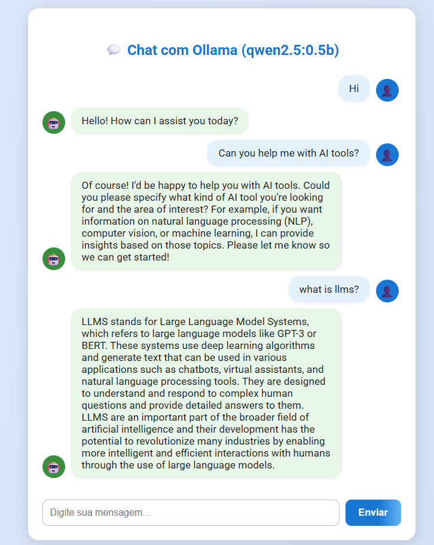

# Ollama with qwen2.5:0.5b Model and Web Chat Frontend

## How to use

### 1. Start the service

```powershell
docker compose up -d
```

### 2. Download the model inside the container

```powershell
docker exec -it ollama-qwen2.5 ollama pull qwen2.5:0.5b
```

### 3. Test the model using the PowerShell script

On Windows, run:

```powershell
./test-ollama.ps1
```

If everything is correct, you will see the model's answer to the question "Qual a capital do Brasil?" (What is the capital of Brazil?).

---

**Notes:**
- The model will only be downloaded the first time.
- The Ollama service will be available at http://localhost:11434.

---

## Example: Web Chat Frontend

Access the Flask address (by default http://localhost:5000) in your browser to use the visual chat interface with Ollama:



You can type questions and chat with the model directly through the web interface.